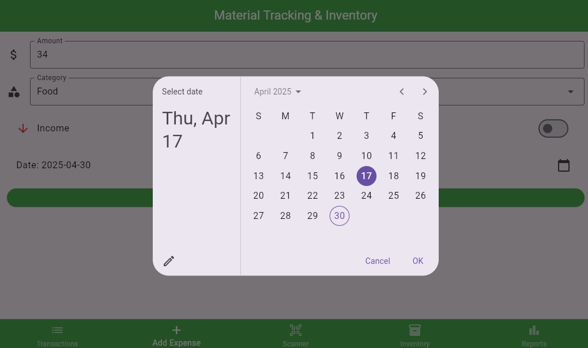
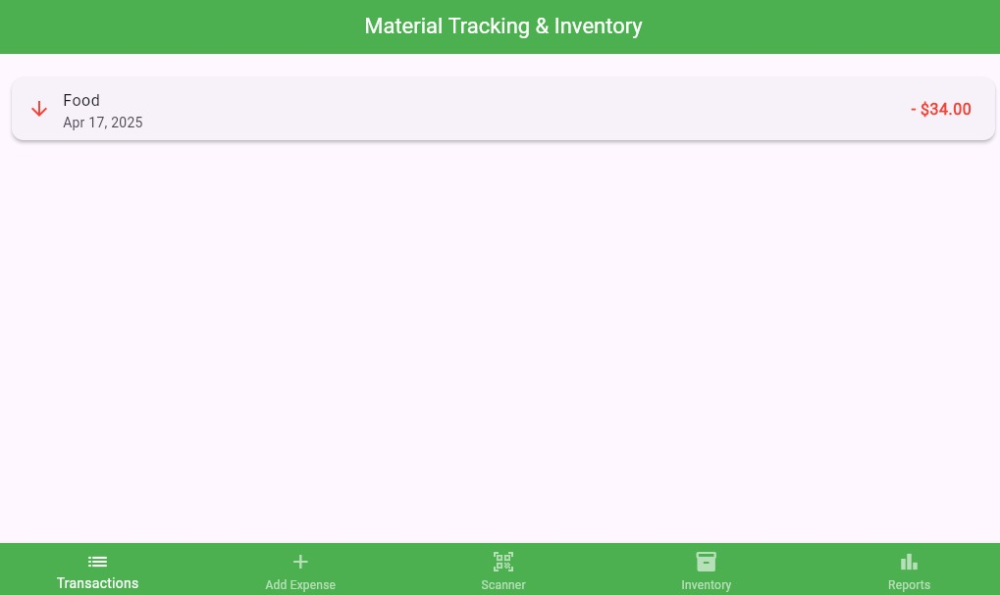
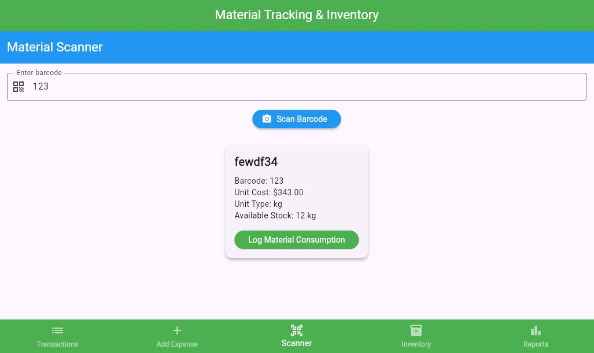
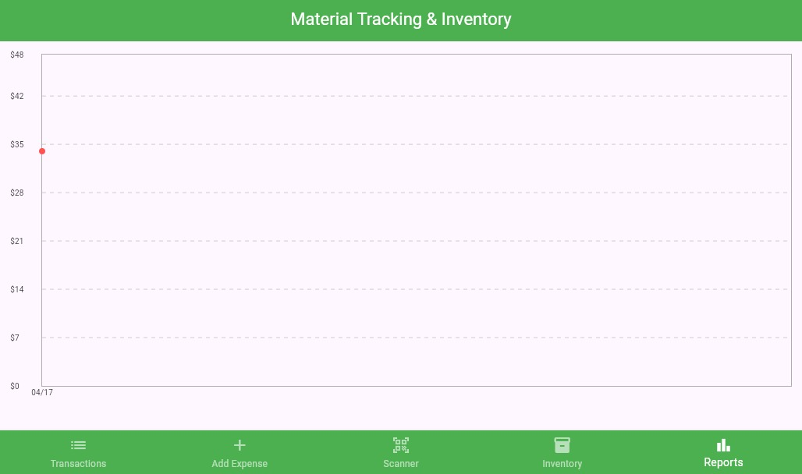
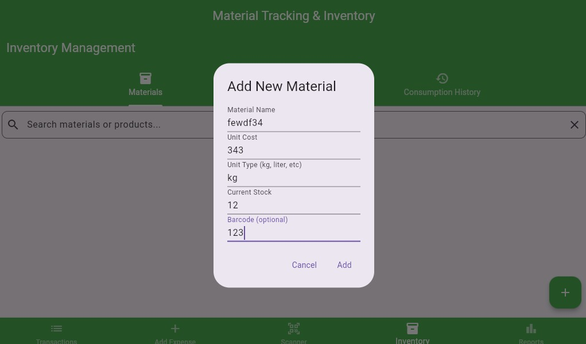

# Material Tracking & Costing App(Q4)

A Flutter-based solution for SmartFab Industries to streamline material tracking, cost management, and inventory control.

## 📱 App Screenshots & Features

### 1. Material Management & Inventory
Add and manage materials with detailed information:
- Material name and barcode
- Unit cost and type
- Current stock levels
- Barcode integration

### 2. Barcode Scanner Integration
Efficiently track materials using built-in scanner:
- Quick barcode scanning
- Real-time material lookup
- Instant stock verification
- Consumption logging

### 3. Transaction History
Track all material movements:
- Detailed transaction logs
- Date-wise filtering
- Cost tracking
- Category-based organization

### 4. Smart Date Selection
Intuitive date picker for:
- Transaction filtering
- Report generation
- Historical data access
- Usage tracking

### 5. Expense Tracking
Monitor and manage costs:
- Amount tracking
- Category classification
- Income/Expense segregation
- Date-based organization

## 🎯 Problem Statement

SmartFab Industries faced challenges with:
- Manual material logging causing stock mismatches
- Time-consuming and error-prone cost calculations
- Lack of role-based access control
- Delayed visibility into inventory and cost metrics

## ✨ Key Features

### 1. Role-Based Access Control (RBAC)
- **Admin Access:**
  - Manage materials, processes, and users
  - Access dashboards and analytics
  - Generate and export reports
- **Operator Access:**
  - Scan materials and log consumption
  - View assigned operations only

### 2. Real-Time Material Tracking
- QR/Barcode scanning functionality
- Automatic material detail fetching
- Offline caching support
- Cloud synchronization

### 3. Smart Inventory Management
- Real-time stock updates
- Low-stock alerts
- Material consumption history
- Search and filter capabilities

### 4. Automated Cost Calculations
- Raw Material Cost = Unit Cost × Quantity Used
- Manufacturing Cost = Raw Material Cost + Processing Costs
- Final Product Price = Manufacturing Cost + Margin
- Dynamic profit margin calculations

### 5. Comprehensive Reporting
- Cost breakdown analysis
- Material usage trends
- Export capabilities (PDF/CSV)
- Real-time analytics dashboard

